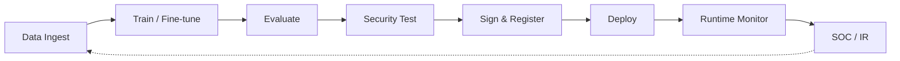
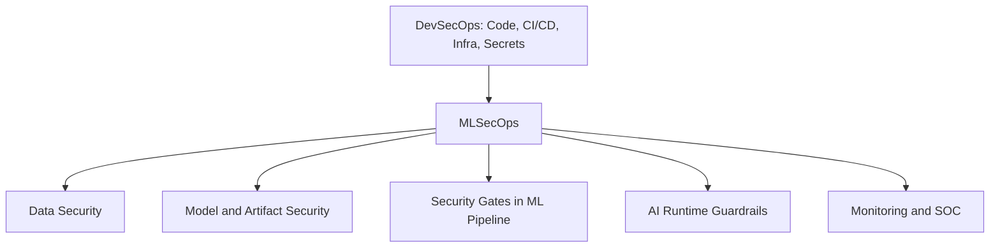

# MLSecOps Guide v0.1

> **An open-source operational guide for securing AI systems across the complete ML lifecycle.**

**Documentation:** [l4tr0d3ctism.github.io/MLSecOps](https://l4tr0d3ctism.github.io/MLSecOps/) · **Repository:** [github.com/l4tr0d3ctism/MLSecOps](https://github.com/l4tr0d3ctism/MLSecOps)

[Read the guide](https://l4tr0d3ctism.github.io/MLSecOps/) · [Quick Start](#quick-start) · [Contribute](CONTRIBUTING.md) · [License](LICENSE)

---

## Why MLSecOps?

AI systems introduce security risks beyond traditional software:

- Training data and dataset lineage
- Model artifacts and weights
- Prompts and system instructions
- Embeddings and vector indexes
- RAG retrieval pipelines
- AI agents and tool execution
- Probabilistic runtime behavior

`MLSecOps` extends `DevSecOps` principles to these AI-native attack surfaces—from data ingest through training, deployment, runtime monitoring, and SOC integration.

> **What this is:** An operational security guide—not a blog post or checklist. It maps threats and controls to OWASP, MITRE ATLAS, NIST AI RMF, and ISO/IEC 42001, with a 10-stage security pipeline and auditable `Evidence Pack`.
>
> **Who it is for:** Security engineers, ML engineers, MLOps teams, platform owners, and governance teams building or operating production AI systems.

---

## Architecture Overview

Executive lifecycle view (detailed 10-stage pipeline in [Chapter 6](chapters-en/06-pipeline.md)):





Full chapter: [Abstract and Introduction](chapters-en/01-intro.md) · Pipeline: [Ten-Stage MLSecOps Pipeline](chapters-en/06-pipeline.md)

---

## Capabilities

| Capability | Coverage |
|---|---|
| AI Supply Chain | Dataset lineage, `SBOM`/`AI-BOM`, model signing, provenance |
| Model Security | Backdoor detection, poisoning, extraction, adversarial testing |
| LLM Security | Prompt injection, jailbreak, output handling, guardrails |
| RAG Security | Retrieval poisoning, embedding risks, ACL at query time |
| Agent Security | Tool abuse, intent gates, memory poisoning, multi-agent |
| Pipeline | 10-stage security pipeline with enforceable gates |
| Runtime | Drift monitoring, inference gateway, telemetry |
| Governance | `Evidence Pack`, EU AI Act mapping, maturity roadmap |
| Operations | SOC integration, incident response, case studies |

Aligned with OWASP LLM Top 10 (2025), MITRE ATLAS, NIST AI RMF, ISO/IEC 42001, OpenSSF MLSecOps, and CSA MAESTRO.

---

## MLSecOps vs DevSecOps

`DevSecOps` secures code, infrastructure, dependencies, containers, secrets, and `CI/CD`.

`MLSecOps` additionally secures data, models, prompts, embeddings, vector databases, RAG, agents, and AI runtime behavior.

| Dimension | `DevSecOps` | `MLSecOps` |
|---|---|---|
| Primary asset | Code, image, dependency | Data, model, embedding, prompt |
| Supply chain artifact | Package, container image | Model weights, dataset, vector index |
| Security testing | SAST, SCA, DAST | Adversarial test, LLM red team, backdoor scan |
| Attack surface | API, container, IaC | Inference API, RAG, agent tools, GPU memory |
| Promotion control | Build and deploy gate | Gate before train, evaluate, sign, and deploy |
| Evidence | SBOM, attestation | SBOM + `AI-BOM`, model signing, `Evidence Pack` |

`MLSecOps` does not replace `DevSecOps`—both must be integrated. See [Chapter 1](chapters-en/01-intro.md) for the full comparison.

---

## Quick Start

1. Read [Chapter 1: Abstract and Introduction](chapters-en/01-intro.md) — problem statement, principles, and lifecycle overview
2. Review [Chapter 2: Scope, Audience, and Threat Model](chapters-en/02-scope-risk-threat-model.md) to understand applicability
3. Explore [Chapter 6: Ten-Stage MLSecOps Pipeline](chapters-en/06-pipeline.md) for implementation
4. Use [Chapter 12: Threat, Control, and Tool Mapping](chapters-en/12-threat-control-tools-map.md) for tool selection

---

## Table of Contents

Full table of contents with section links: **[chapters-en/TABLE-OF-CONTENTS.md](chapters-en/TABLE-OF-CONTENTS.md)**

| # | Chapter |
|---|---|
| 1 | [Abstract and Introduction](chapters-en/01-intro.md) |
| 2 | [Scope, Audience, and Threat Model](chapters-en/02-scope-risk-threat-model.md) |
| 3 | [Autonomous AI Threats and Offensive AI Operations](chapters-en/03-threat-landscape.md) |
| 4 | [Data Security and Privacy](chapters-en/04-data-security-privacy.md) |
| 5 | [Model, Artifact, and Supply Chain Security](chapters-en/05-model-artifact-supply-chain.md) |
| 6 | [Ten-Stage MLSecOps Pipeline](chapters-en/06-pipeline.md) |
| 7 | [LLM and RAG Security](chapters-en/07-llm-rag-security.md) |
| 8 | [Agentic AI Security](chapters-en/08-agentic-ai-security.md) |
| 9 | [Anti-patterns in MLSecOps](chapters-en/09-anti-patterns.md) |
| 10 | [Monitoring, SOC, and Incident Response](chapters-en/10-monitoring-soc-ir.md) |
| 11 | [Governance, Compliance, and Evidence Pack](chapters-en/11-governance-evidence.md) |
| 12 | [Threat, Control, and Tool Mapping](chapters-en/12-threat-control-tools-map.md) |
| 13 | [Case Studies and Lessons Learned](chapters-en/13-case-studies.md) |
| 14 | [MLSecOps Maturity Roadmap](chapters-en/14-maturity-roadmap.md) |
| 15 | [Conclusion and Appendices](chapters-en/15-conclusion-appendix.md) |

---

## Roadmap

- [x] Lifecycle model and MLSecOps principles
- [x] Threat taxonomy (classic ML, LLM, RAG, agents)
- [x] 10-stage security pipeline with gates
- [x] Threat, control, and tool mapping
- [x] Governance, Evidence Pack, and maturity model
- [x] Case studies and operational checklists
- [x] Documentation site (MkDocs + GitHub Pages)
- [ ] Architecture diagram assets (`docs/images/`)
- [ ] CI/CD reference pipeline (GitHub Actions / GitLab CI example)
- [ ] Kubernetes MLSecOps deployment examples
- [ ] Automated Evidence Pack collection scripts
- [ ] Zenodo release with DOI for citation

---

## Project Status

**Version:** v0.1 (draft)

This project is a research-driven **operational guide**—not an official industry standard. Content is based on published frameworks and knowledge through the end of 2025. Given the pace of change in LLM and Agentic AI, readers should periodically review new versions of OWASP LLM Top 10, MITRE ATLAS, and related standards.

Community feedback, issues, and contributions are welcome.

---

## Cite This Work

If you reference this guide in research, a resume, or internal documentation:

```text
Haghighian, M. MLSecOps Guide (v0.1): Securing AI Systems Across the Lifecycle.
GitHub, 2025.
```

A Zenodo DOI will be added in a future release (see [Roadmap](#roadmap)).

**Documentation site:** https://l4tr0d3ctism.github.io/MLSecOps/

---

## Frameworks Referenced

- OWASP Top 10 for LLM Applications (2025)
- OWASP Machine Learning Security Top 10
- OWASP Top 10 for Agentic Applications
- MITRE ATLAS (Adversarial Threat Landscape for AI Systems)
- NIST AI Risk Management Framework (AI RMF 1.0)
- ISO/IEC 42001:2023 (Artificial Intelligence Management System)
- ISO/IEC 23894:2023 (AI Risk Management)
- EU AI Act
- OpenSSF MLSecOps Whitepaper
- Cloud Security Alliance MAESTRO Framework

---

## Contributing

Contributions are welcome! Please read [CONTRIBUTING.md](CONTRIBUTING.md) for details.

## License

This project is licensed under the Creative Commons Attribution-ShareAlike 4.0 International License (CC BY-SA 4.0). See [LICENSE](LICENSE).

## Acknowledgments

This guide was developed by combining reference frameworks, real-world case studies, and operational implementation patterns. Special thanks to the OWASP community, MITRE ATLAS, NIST, and the broader AI security community.

## Contact

For questions, feedback, or collaboration opportunities, please open an issue or discussion in this repository.

---

## Build documentation locally

For maintainers only — copies chapters into `docs/` and serves the site:

```bash
pip install -r requirements.txt
powershell -File scripts/prepare-docs.ps1   # Windows
# bash scripts/prepare-docs.sh              # Linux / macOS / CI
mkdocs serve
```

Open http://127.0.0.1:8000. The site deploys to GitHub Pages on push to `main` via `.github/workflows/deploy-docs.yml`.

**Enable Pages once:** Repository → Settings → Pages → Build and deployment → Source: **GitHub Actions**.

Published URL: https://l4tr0d3ctism.github.io/MLSecOps/
