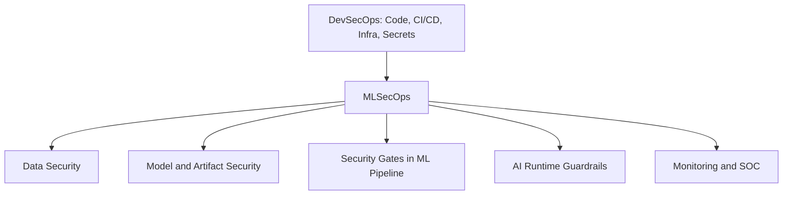
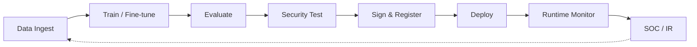

# Chapter 1: Abstract and Introduction

## Abstract

`MLSecOps` is a practical security framework for securing AI-based systems throughout their entire lifecycle—from data collection and model training to deployment, execution, monitoring, and incident response. This approach transforms security from a one-time pre-release check into an engineered, measurable, repeatable, and auditable process.

This guide focuses on AI supply chain threats, `Adversarial ML` attacks, large language model security, `RAG` systems, intelligent agents, and security controls at `Runtime`. The goal is to provide a practical architecture for teams that develop or maintain `ML` and `AI` systems in real-world operational environments.

**Problem:** Traditional `DevSecOps` controls are insufficient for AI systems because security risks extend beyond source code into data, models, prompts, embeddings, retrieval pipelines, and autonomous agents. Security failures in production AI systems often occur outside the application code layer—in training data, model artifacts, `RAG` indexes, and runtime behavior.

**Method:** This guide was developed by combining reference frameworks (`OWASP LLM/ML Top 10`, `MITRE ATLAS`, `NIST AI RMF`, `ISO/IEC 42001`, `OpenSSF MLSecOps`, `CSA MAESTRO`), real-world case studies, and operational implementation patterns. This guide is based on frameworks and knowledge published through the end of 2025.

**Key finding:** AI system security is defensible only when viewed as a continuous, auditable flow from data through runtime and SOC—not as periodic controls.

**Limitations:** This guide focuses on enterprise ML/LLM/Agent systems; `Edge/IoT/CPS` domains, safety, and industry-specific legal requirements are covered only briefly and require specialized resources.

**Keywords:** `MLSecOps`, `LLM Security`, `RAG Security`, `Agentic AI`, `Adversarial ML`, `AI Supply Chain`, `Model Signing`, `Security Pipeline`, `Evidence Pack`, `AI Governance`.

## Introduction

In classic software, `DevSecOps` successfully narrowed the gap between development, operations, and security. However, AI systems have several fundamental characteristics that make the same security model insufficient for them.

## Why DevSecOps Is Insufficient

| Characteristic | Security impact |
|---|---|
| Heavy dependence on data | Data quality, privacy, and integrity directly determine model behavior. |
| Probabilistic behavior | A successful test does not guarantee the same attack will not recur in `Production`. |
| Broad attack surface | In addition to code, data, models, `Artifact`s, prompts, memory, tools, and `Retrieval` are also attackable. |
| Environmental variability | `Data Drift`, dependency changes, and shifts in user patterns can turn a secure model yesterday into an insecure one today. |

Probabilistic behavior in AI systems creates a serious security difference. In classic software, identical input usually yields identical output; but in AI models, the same prompt or the same data can produce different responses depending on conversation context, model settings such as `temperature`, model version, or data retrieved in `RAG`. From a security perspective, this means a successful test does not guarantee an attack will recur in `Production`; many attacks such as `Prompt Injection` take effect only in a specific combination of context—not like classic `SQL Injection` with a fixed, fully predictable input.

`MLSecOps` means security is not just a step before release. Security must be applied at every decision point in the model lifecycle: when data enters, when a base model is selected, during training, evaluation, signing, deployment, when user requests are received, when tools are invoked, when documents are retrieved, and when model behavior is monitored.

## AI Threat Surface (Executive Overview)

Threats in AI systems span multiple layers—not only application code. The overview below orients security teams before detailed analysis in later chapters.

| Layer | Example risks |
|---|---|
| Data | `Data Poisoning`, sensitive data leakage, training data extraction |
| Model | `Backdoor`, weight tampering, model theft, `Model Inversion` |
| Application | `Prompt Injection`, `RAG`/`Retrieval Poisoning`, `Tool Abuse`, unsafe output handling |
| Runtime | `Data Drift`, evasion, guardrail bypass, unmonitored agent actions |

> Full threat taxonomy: [Chapter 3](03-threat-landscape.md). Operational threat model and scope: [Chapter 2](02-scope-risk-threat-model.md).

## MLSecOps Principles

These principles define how security decisions are made across the AI lifecycle:

| # | Principle | Summary |
|---|---|---|
| 1 | **Evidence before deployment** | No AI artifact enters production without traceable security evidence. |
| 2 | **Security gates before promotion** | Train, evaluate, sign, and deploy only after defined `Go/No-Go` criteria pass. |
| 3 | **Continuous runtime validation** | Production behavior is monitored; drift, injection, and tool abuse are detected and responded to. |
| 4 | **Traceable AI supply chain** | `SBOM`, `AI-BOM`, signing, and provenance record model origin, data lineage, and test history. |
| 5 | **Threat-modeled controls** | Controls match architecture and risk—not generic AI security checklists. |
| 6 | **Measurable, repeatable, auditable process** | Security decisions use defined criteria, run on every build or retrain, and leave reviewable records. |

**Principle 1 in practice:** Evidence must show where data came from, how the model was built, which tests were run, who approved release, which `Artifact`s were signed, and which behaviors are monitored at runtime.

## Relationship between MLSecOps and DevSecOps

`DevSecOps` provides the foundation for securing code, infrastructure, dependencies, containers, secrets, and `CI/CD`. `MLSecOps` extends this foundation for AI-specific assets: data, models, `Feature Store`, `Model Registry`, `Prompt`, `Embedding`, `Vector DB`, `RAG`, and intelligent agents.

| Dimension | `DevSecOps` | `MLSecOps` |
|---|---|---|
| Primary asset | Code, image, dependency | Data, model, embedding, prompt |
| Supply chain artifact | Package, container image | Model weights, dataset, vector index, prompt template |
| Security testing | SAST, SCA, DAST | Adversarial test, LLM red team, backdoor scan |
| Attack surface | API, container, IaC | Inference API, RAG, agent tool, GPU memory |
| Promotion control | Build and deploy gate | Gate before train, evaluate, sign, and deploy |
| Monitoring | Log, metric, alert | Drift, prompt injection, tool abuse |
| Evidence | SBOM, attestation | SBOM + `AI-BOM`, model signing, `Evidence Pack` |

`MLSecOps` does not replace `DevSecOps`; without a solid `DevSecOps` foundation, `MLSecOps` cannot endure. Both must be integrated into the pipeline.

### AI supply chain evidence (`AI-BOM`)

`AI-BOM` extends `SBOM` for AI-specific artifacts. At minimum it should describe model origin, dataset lineage, training framework, fine-tuning history, dependencies, evaluation results, security tests, and deployment artifacts. Full requirements, tooling, and pipeline integration are covered in [Chapter 5](05-model-artifact-supply-chain.md).

## Lifecycle Overview

Each stage in this lifecycle maps to security gates, evidence collection, and controls described in [Chapter 6](06-pipeline.md). The diagram below is an executive view (8 stages); Chapter 6 defines the operational 10-stage pipeline with explicit gates.

| Executive lifecycle (Ch.1) | Pipeline stages (Ch.6) |
|---|---|
| Data Ingest | 1 `Trigger Pipeline`, 2 `Load Artifacts`, 3 `Security & Quality Scan`, 4 `Quality Gate 1` |
| Train / Fine-tune | 5 `Train Model` |
| Evaluate | 6 `Evaluate Model` |
| Security Test | 7 `Final Security Testing` |
| Sign & Register | 8 `Final Quality Gate`, 9 `Sign Model` |
| Deploy | 10 `Store & Monitor` (release artifact to registry and serving path) |
| Runtime Monitor | 10 `Store & Monitor` (telemetry and guardrails) |
| SOC / IR | 10 `Store & Monitor` + Chapter 10 SOC integration |

## Focus of this guide and distinction from AISecOps

This guide focuses specifically on `MLSecOps`: securing the full lifecycle of `ML/AI` systems from data and training through artifacts, pipeline, deployment, runtime, and monitoring.

`MLSecOps` must not be confused with the similar term `AISecOps`, because these are two different domains:

| Term | Definition | Central question |
|---|---|---|
| `MLSecOps` | Security of the model lifecycle and AI systems (subject of this guide) | "How do I build, release, and run an AI system securely?" |
| `AISecOps` | Using artificial intelligence within security operations itself—employing AI for threat detection, alert triage, analysis, and automated response in the `SOC` (per NSFOCUS definition, combining `AIOps` + `AISec` + `SecOps`) | "How do I use AI to automate security operations?" |

In simple terms: `MLSecOps` means "securing AI," while `AISecOps` means "using AI for security." This guide is entirely within the `MLSecOps` domain and does not enter the realm of `AISecOps`; although in Chapter 10, which addresses integration with the `SOC`, the practical point of contact between these two domains is shown.

In short, `MLSecOps` applies the same logic as `DevSecOps`, but for securing data, models, the `Pipeline`, `Runtime`, and the behavior of AI systems—not just code and infrastructure.
