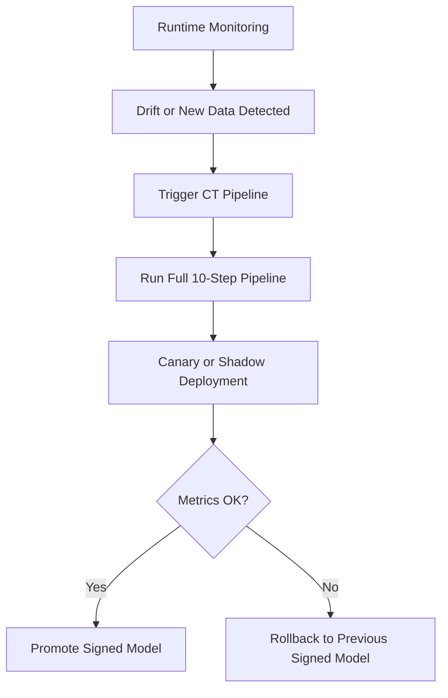

# Chapter 6: Ten-Stage MLSecOps Pipeline

## Pipeline objective

The `MLSecOps` pipeline continuously and automatically embeds security into the model build, evaluation, signing, deployment, and monitoring cycle. The goal is that no model, data, or `Artifact` enters the operational environment without passing security controls and producing auditable evidence.

## Pipeline overview

This pipeline begins with a prerequisite activity (`Planning` and `Threat Modeling`) and then includes ten main stages—from `Trigger` to `Store & Monitor`. At each sensitive point there is a `Security Gate` that stops release on failure. The stage flow diagram follows, and details of each stage are explained in subsequent sections.

## Prerequisite: Planning and Threat Modeling

Before the pipeline is triggered, several activities must be completed; otherwise later gates will lack precise criteria:

- Precise definition of system scope including data, model, API, `RAG`, and agent
- Threat modeling with `OWASP ML/LLM Top 10` and `MITRE ATLAS`
- Selection of mandatory controls and acceptable risk level
- Versioned recording of threat model output in `Evidence Pack`

```mermaid
flowchart LR
    A[1 Trigger] --> B[2 Load Artifacts]
    B --> C[3 Security and Quality Scan]
    C --> D[4 Quality Gate 1]
    D --> E[5 Train Model]
    E --> F[6 Evaluate Model]
    F --> G[7 Final Security Testing]
    G --> H[8 Final Quality Gate]
    H --> I[9 Sign Model]
    I --> J[10 Store and Monitor]
```

## Pipeline stages

| Stage | Name | Security objective | Output |
|---|---|---|---|
| 1 | `Trigger Pipeline` | Reliable and repeatable start | Event log and pipeline version |
| 2 | `Load Artifacts` | Secure loading of data, base model, and dependencies | `Manifest` and hashes |
| 3 | `Security & Quality Scan` | Scan code, data, model, dependencies, and IaC | Vulnerability and quality report |
| 4 | `Quality Gate 1` | Stop before training if high risk | `Go/No-Go` decision |
| 5 | `Train Model` | Training in isolated, traceable environment | Trained model and experiment log |
| 6 | `Evaluate Model` | Performance, fairness, and baseline evaluation | Evaluation report |
| 7 | `Final Security Testing` | Attack, backdoor, and prompt injection testing | Full security report |
| 8 | `Final Quality Gate` | Final policy and compliance review | Release approval |
| 9 | `Sign Model` | Model signing and provenance recording | Signed model and attestation |
| 10 | `Store & Monitor` | Secure storage and monitoring activation | `Evidence Pack` and telemetry |

## Practical notes for each stage

| Stage | Practical note |
|---|---|
| 1. `Trigger Pipeline` | Pipeline should be triggered only by trusted events such as merge request, authorized commit, valid schedule, or manual approval. Webhooks must be secure and signed. |
| 2. `Load Artifacts` | Dataset, base model, notebook, and dependencies must be loaded from authorized sources; `ModelScan`, pickle check, and manifest generation including hashes must be done before training. |
| 3. `Security & Quality Scan` | In addition to SAST and SCA, use tools such as `Gitleaks`, `Trivy`, `NB Defense`, `Checkov`/`tfsec` (for IaC), and `lintML` (ML security linter from Nvidia) for secrets, containers, notebooks, and ML code. Note: `lintML` runs underlying scanners via Docker containers; CI runners must have Docker available. |
| 4. `Quality Gate 1` | This gate before training blocks unmasked sensitive data, critical vulnerabilities, or poisoned artifacts. |
| 5. `Train Model` | Training must run in sandbox with least privilege; parameters and experiments must be recorded with tools such as `MLflow`. |
| 6. `Evaluate Model` | In addition to accuracy, check metrics such as `F1`, fairness, initial robustness, and baseline alignment. |
| 7. `Final Security Testing` | For classic models use `ART`; for `LLM/RAG/Agent` use tests such as `Promptfoo`, `Garak`, or a fixed regression set. |
| 8. `Final Quality Gate` | Security policies, compliance, and business criteria must be approved before signing. |
| 9. `Sign Model` | Model and artifacts must be signed with tools such as `Cosign` or `Sigstore`; attestation must include `AI-BOM/SBOM`, gate results, and threat model. |
| 10. `Store & Monitor` | Final artifact stored in secure repository with object lock; telemetry including prompt, tool call, response, and model version sent to `SIEM/SOC`. |

## Security Gates

In this pipeline, `Gate`s are real stop points, not merely alerts. If sensitive data is unmasked, a critical vulnerability exists, security testing fails, or model signature is invalid, release must be stopped.

| Gate | When executed | Why it matters |
|---|---|---|
| `Quality Gate 1` | Before training | Prevent consumption of poisoned data or dependencies |
| `Final Security Testing` | After training | Measure model resistance and unsafe behavior |
| `Final Quality Gate` | Before signing | Review policy, risk, and compliance |
| `Sign Model` | Before final storage | Ensure authenticity and prevent tampering |

## Continuous Training cycle

After deployment, the model may need retraining due to `Data Drift`, new data, or performance decline. The `Continuous Training` cycle must not have security shortcuts. Retrained models must go through the same controls as the initial model.

Stages 4, 7, 8, and 9 in the `CT` cycle are critical and must never be bypassed under any circumstances: `Quality Gate 1`, `Final Security Testing`, `Final Quality Gate`, and `Sign Model` (see pipeline stage table above—not every numbered stage is a gate).

## CT cycle risks

| Risk | Recommended control |
|---|---|
| `Catastrophic Forgetting` | Run regression security test on fixed set |
| `Data Drift` | Statistical monitoring with defined threshold |
| `Adversarial Drift` | SOC analysis and manual review of suspicious data |
| `Model Collapse` | Limit synthetic data and monitor output diversity |
| Excessive retraining | Cap frequency and require human approval in sensitive cases |

## Execution stages in CT cycle

| Step | Stage | Status | Description |
|---|---|---|---|
| 1 | `Trigger Pipeline` | Automatic activation | By drift monitoring system or new data arrival |
| 2 | `Load Artifacts` | Full execution | Load new data, base model, and dependencies |
| 3 | `Security & Quality Tools` | Full execution | Scan new data, PII detection, and dependency review |
| 4 | `Quality Gate 1` | Mandatory gate | Data validation before training; no pass means stop |
| 5 | `Train Model` | Full execution | Retrain on new data with same constraints |
| 6 | `Evaluation Model` | Full execution | Evaluate performance and fairness of retrained model |
| 7 | `Final Security Testing` | Mandatory gate | Adversarial, prompt injection, backdoor, and ASR acceptance tests |
| 8 | `Final Quality Gate` | Mandatory gate | Approve compliance policies and acceptance criteria |
| 9 | `Sign Model` | Mandatory gate | Digital signing of new model with secure key |
| 10 | `Store & Monitor` | Full execution | Store new version and activate monitoring |

Basic CT cycle controls include validation of new data origin and quality, rescanning artifacts and dependencies, full execution of policy gates, digital signing of retrained model, and automatic recording of results in `Evidence Pack`.

## Secure deployment methods for retrained models

| Method | Description |
|---|---|
| `Canary Deployment` | Only 1 to 5 percent of real traffic routed to new model; security and performance metrics compared with previous version. |
| `Shadow Mode` | New model runs alongside current model but its response is not delivered to user; used only to observe behavior. |
| `Automated Rollback` | If `Prompt Injection` rate, policy error, or performance decline exceeds threshold, system reverts to previous signed model. |

## Difference between Data Drift and Adversarial Drift

`Data Drift` is usually seen as change in feature distribution, `Embedding Drift`, or schema changes. In contrast, `Adversarial Drift` is often accompanied by spikes in suspicious prompts, abnormal tool calls, or suspicious session patterns. These two phenomena must have separate response playbooks.

## Alignment with MLOps lifecycle

This guide's 10-stage security pipeline extends the OpenSSF Secure MLOps lifecycle (9 primary stages in the 2025 whitepaper) by splitting artifact loading, scanning, and signing into explicit security stages with enforceable gates.

| Standard `MLOps` stage | Equivalent step in this guide's pipeline |
|---|---|
| `Planning and Design` | Threat modeling and scope definition |
| `Data Engineering` | Artifact loading and data approval gate |
| `Experimentation` | Model training and experiment recording |
| `ML Pipeline Dev & Test` | Code scan and final security testing |
| `CI` | Event recording through initial gate approval |
| `CD` | Final approval, signing, and release preparation |
| `Continuous Training` | Retraining after monitoring |
| `Model Serving` | Runtime and inference infrastructure |
| `Continuous Monitoring` | Live monitoring and SOC integration |

## Common implementation challenges

| Challenge | Practical recommendation |
|---|---|
| Different nature of `DevSecOps` and `MLSecOps` threats | Define dedicated threat model for data, model, and inference. |
| Complexity of continuous retraining | Mandatory `Quality Gate 1`, `Final Security Testing`, `Final Quality Gate`, and `Sign Model` in every CT cycle with canary deployment. |
| Opaque behavior inside models | Combine robustness testing, runtime monitoring, and human review for high-risk cases. |
| Risk of frequent retraining | Limit CT frequency and maintain fixed security baseline for comparison. |
| Output authenticity and reproducibility | Use `AI-BOM`, lineage, and signing integrally. |
| Difficulty of risk assessment | Separate operational risk from technical threat and produce `Evidence Pack` continuously. |

## Minimum security baseline

| Domain | Minimum control |
|---|---|
| Supply chain | Model scan with `ModelScan` and basic `SBOM/AI-BOM` generation |
| Integrity | Digital model signing and verify before deployment |
| Data | `Schema Validation` and `PII Detection & Masking` |
| Pipeline | At least one automated policy gate at stages 4 and 8 |
| Classic model | `ART` test and numerical `ASR` criterion at gate 7 |
| `LLM/RAG` | Automated `Prompt Injection` test and guardrail evaluation |
| Runtime | Deployment behind `Inference Gateway` |
| Monitoring | Send prompt, tool call, and model version to `SIEM/SOC` |
| Incident | Automated rollback and stable version snapshot |

## Pipeline control prioritization

| Level | Controls |
|---|---|
| `MUST` | `ModelScan`, digital signing, gates 4 and 8, stage 7 security testing |
| `SHOULD` | Automated `SBOM/AI-BOM` generation, canary in CT, automated `Evidence Pack` recording |
| `ADVANCED` | Full CT automation, advanced regression security test, and event mapping to `MITRE ATLAS` |

## Stage 7 test acceptance conditions

Acceptance thresholds must be defined and versioned in the organization's threat model; values below are examples, not fixed numbers for all systems:

| System type | Test Suite | Acceptance condition |
|---|---|---|
| Classic model | `ART` and backdoor evaluation | `ASR` and accuracy drop must be within threat model-defined thresholds. |
| `LLM/RAG` | `Prompt Injection` and retrieval leak probes | Bypass rate less than or equal to threat model threshold. |
| Agent | Tool misuse and output injection cases | No critical fail in fixed regression set allowed. |

## Red Team program and security test cadence

One-time security testing is not enough (Chapter 9). Red Team program must be versioned, repeatable, and have defined cadence:

| Test type | Example tool | Recommended cadence |
|---|---|---|
| Automated prompt injection / jailbreak test | `Garak`, `Promptfoo`, `PyRIT` | Every build and every prompt/model change |
| Classic model adversarial test | `ART` (FGSM, PGD, HopSkipJump) | Every new model and every CT |
| Manual / scenario-based Red Team | Internal or external team | Quarterly or before major release |
| Security regression test | Fixed versioned suite | Every build (automated) |
| Agent logic and tool misuse test | Custom scenarios | Every agent release |

Results of each run must be recorded in `Evidence Pack` with test suite hash for baseline comparison (Chapter 11).

## Expected pipeline behavior pattern

In a practical implementation, each tool must either stop the pipeline through non-zero `exit code` (`fail-closed`) or produce structured output (usually JSON) so a policy engine such as `OPA`/`Conftest` can evaluate it. Tool details and connection patterns are in Chapter 12. The reader can build a pipeline suited to their CI/CD by referring to official documentation for each tool (`ModelScan`, `Garak`, `Promptfoo`, and `Sigstore`) and Chapter 12.

For installation details, commands, and exact behavior of each tool, refer to the "Practical Tool Guide" in Chapter 12.

## Golden rule

No model should reach `Production` without digital signature, `SBOM/AI-BOM`, successful passage through `Policy Gate`s, and `Evidence Pack` generation.

## Operational summary

1. No deploy is allowed without passing supervisory gates and recording digital signature.
2. Full scan of model files before training process is mandatory.
3. `CT` cycle must repeat all stages and security gates of the main pipeline without shortcuts.
4. Retrained models must enter the real environment through canary path.
