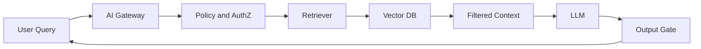
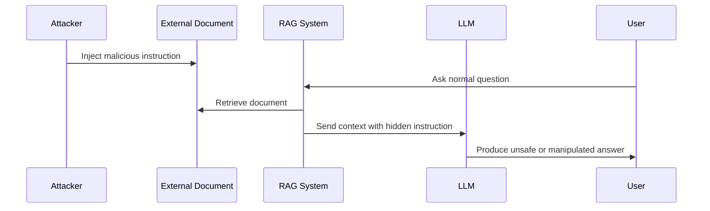

# Chapter 7: LLM and RAG Security

## How LLM security differs from classic ML

In classic models, security focus is mostly on training data, the model, numeric or image input, and `Artifact`. But in `LLM` and `RAG` systems, a large share of risk shifts to runtime. The model interacts with the user, documents, tools, memory, and organizational policies—and each can be an attack surface.

## Primary LLM threats

| Threat (`OWASP LLM 2025`) | Description | Control |
|---|---|---|
| `LLM01` Prompt Injection | Bypassing instructions or changing model behavior | Strict `System Prompt`, `Gateway`, red team testing |
| `LLM02` Sensitive Information Disclosure | Disclosure of sensitive or confidential data | `DLP`, context control, output restrictions |
| `LLM04` Data and Model Poisoning | Poisoned training data, fine-tuning, or RAG corpus | Data validation, ingest controls, re-index playbook |
| `LLM05` Improper Output Handling | Unsafe use of model output by another system | Output validation and sandbox |
| `LLM06` Excessive Agency | Agent or tool actions beyond intended scope | Tool allowlist, `Intent Gate`, human approval |
| `LLM08` Vector and Embedding Weaknesses | Poisoned or leaked retrieval/embedding data | ACL at retrieval, tenant isolation, ingest scan |
| `LLM09` Misinformation | Harmful or unreliable generated content | Human review, grounding, output policy |
| `LLM10` Unbounded Consumption | High token consumption or expensive requests | Rate limit, quota, and cost monitoring |

> Note: `Overreliance` appeared in OWASP LLM Top 10 (2023) but was removed in the 2025 edition; related risks are partly covered by `LLM09` Misinformation and operational human-review controls.

## Security controls for LLM

LLM security is not solved by installing a single tool. A set of capabilities must work together:

| Control | Description |
|---|---|
| Runtime guidance and prompt filtering | Tools such as `NeMo Guardrails`, `Lakera Guard`, or an internal gateway inspect incoming prompts before they are sent to the model. |
| `Pre-Inference Scanning` | Inputs are scanned for malicious patterns, bypass attempts, or sensitive data. |
| Output management and risk scoring | Model output is checked for information leakage and, when needed, blocked, redacted, or reviewed. |
| `AI Gateway` | A single entry point for applying security policies, rate limits, logging, and access control. |
| `Session Risk Scoring` | User behavior throughout the session is analyzed; if a suspicious pattern appears, response level or access is restricted. |
| Prompt anomaly detection | Sudden changes in prompt structure, length, or content relative to normal behavior are identified. |
| `Egress Filtering` | Attempts to exfiltrate sensitive data through model responses or tools are blocked. |

## Secure architecture for RAG

## Ingest security in RAG

In `RAG`, every document that enters the knowledge base can later affect the model's response. Therefore, the `Ingest Pipeline` must be treated as a serious security boundary.

Essential controls:

- Only authorized sources are indexed.
- Documents are checked for malicious content and sensitive data before indexing.
- Document access level is stored alongside the embedding.
- Data for each tenant is kept separate.
- Document changes are versioned and traceable.

## Three-layer controls in RAG

| Layer | Control |
|---|---|
| `Retriever` | source allowlist, integrity check, hash verification and document source signature |
| `Reranker` | security scoring alongside relevance and removal of documents with low security scores |
| `Context` | separation of `System Prompt`, `User Prompt`, and `Retrieved Context`, length limits and sanitization before concatenation into the prompt |

## Retrieval Poisoning

In `Retrieval Poisoning`, an attacker introduces a document or content into the knowledge source that causes retrieval of malicious or biased context. This attack is dangerous because the user may not have sent any malicious prompt, yet the model may follow instructions from a poisoned document.

| Failure point | Impact | Control |
|---|---|---|
| ingest without review | poisoned document entry | scan and approval |
| no ACL in retrieval | unauthorized document disclosure | authorization at query time |
| shared index across tenants | data leakage between customers | separate index |
| no cleanup | persistence of contamination | re-index and lifecycle policy |

## Embedding Poisoning

Sample scenario: an attacker introduces a poisoned document through a webhook, user upload, or automatic sync. After conversion to an embedding, this document becomes close to seemingly unrelated queries and is retrieved as context at inference time.

| Stage | Attack | Technical control |
|---|---|---|
| `Ingestion` | entry of poisoned document | source allowlist, antivirus scan and metadata, human approval for new sources, quarantine bucket |
| `Index` | storage of poisoned vector | content hash before indexing, index versioning, separate index per tenant |
| `Retrieval` | deviation in top-k | reranking with security signals, minimum number of sources, blocking suspicious clusters |
| `Response` | execution of instructions from context | mandatory citation, grounding check and output gate |

## Reindex Playbook

1. Identify the poisoned batch using `Lineage`.
2. Remove that batch from the index.
3. Regenerate embeddings with an approved embedding model.
4. Run security regression tests for prompt and RAG before publishing the new index.

## Cloud Native and Multi-Tenant deployment

| Layer | Control | Implementation example |
|---|---|---|
| tenant identification | every request must have a valid `Tenant ID` | `JWT Claim` or signed header |
| Kubernetes RBAC | separate namespace for model workload | separate `Role`, `RoleBinding`, and service account |
| network | only gateway has access to inference pod | default deny egress |
| Service Mesh | mTLS and authorization | `Istio` or `Linkerd` |
| Vector DB | physical separation of indexes | avoid metadata filter on shared index |
| shared inference | quota and queue per tenant | rate limit and prevention of cache leakage |

In `vLLM` or shared GPU scenarios, model weights may be shared, but context and `KV Cache` must never be shared between tenants. Session stickiness and cache cleanup after session end must be mandatory.

## Advanced Multi-Tenant hardening

| Risk | Control |
|---|---|
| `KV Cache Leak` | partition by tenant and cleanup after session |
| `GPU Colocation` | use `MIG` or dedicated GPU for sensitive tiers |
| `Model Multiplexing` | tenant-aware batching and separation with padding |
| `Speculative Decoding` | separate draft state or disable shared state |
| `Tokenizer Timing Side-Channel` | rate limit, fixed padding and temporal anomaly auditing |
| `Shared Inference Cache` | cache key includes tenant ID and prompt hash |

## Fine-tuning risks

| Threat | Security risk | Control |
|---|---|---|
| `Model Collapse` | repetitive output, quality degradation and failure of safety policies | synthetic data ceiling, output diversity evaluation, run gate 7 after every fine-tuning |
| `Overrefusal` | users are pushed toward bypass techniques | measure false positive block rate, secure usability testing and policy threshold tuning |

Research sources related to `Model Collapse` such as Shumailov et al. and `OWASP LLM` guidance on `Overrefusal` show that these are not merely response quality issues; both can directly affect security and the ability to bypass controls.

## System Prompt Leakage (LLM07)

In `System Prompt Leakage`, an attacker or user attempts to extract system instructions, internal policy, tool names, or moderation rules. This disclosure can make subsequent bypass easier.

| Vector | Control |
|---|---|
| explicit request to "repeat your instructions" | output gate and pattern blocklist |
| gradual extraction across multiple turns | session risk scoring and rate limit |
| leakage through error message or stack trace | error sanitization and separation of debug from production |

## Advanced Prompt Injection techniques

Beyond simple text prompts, the following attacks have been reported in production environments:

| Technique | Description | Control |
|---|---|---|
| `Token Smuggling` | hiding instructions in unusual tokenization or encoding | input normalisation, tokenizer audit |
| `ASCII Art Bypass` | malicious instruction as ASCII art characters that bypass text filters | Unicode normalization, pattern detection, length/entropy heuristics |
| `Invisible Unicode` | use of Unicode `TAG` block (`U+E0000–U+E007F`) for hidden text | Unicode normalisation, character whitelist |
| `Markdown/HTML Injection` | hidden link or comment in retrieved document | strip HTML, plain-text context |
| `Many-shot Jailbreak` | repetition of jailbreak examples in long context | context length limit, multi-stage moderation |

## Direct and indirect Prompt Injection

Direct `Prompt Injection` occurs when the user explicitly sends a malicious instruction. Indirect `Prompt Injection` occurs when a malicious instruction is hidden inside an external source and enters the model context through `RAG` or a tool.

Sample attack path:

## Guardrails

`Guardrail`s must run both before and after the model. Pre-model control inspects input and context. Post-model control inspects output for data leakage, dangerous content, executable instructions, and policy violations.

| Control location | Example control |
|---|---|
| before model | prompt injection detection, removal of suspicious context, token limits |
| during retrieval | ACL enforcement, source filtering, secure rerank |
| after model | DLP, output validation, moderation |
| after action | logging, alert, human approval requirement |

## Guardrail limitations

`Guardrail` is a useful defensive layer, but not complete or definitive control. Relying solely on guardrails is an `Anti-pattern` (Chapter 9). Main limitations:

| Limitation | Description |
|---|---|
| bypass via obfuscation | techniques such as `Token Smuggling`, invisible Unicode, or multilingual content can bypass filters. |
| false positive/negative rate | strict thresholds cause `Overrefusal` and loose thresholds allow attacks to pass. |
| lack of full semantic understanding | guardrail classifiers often see patterns, not true intent. |
| latency and cost | adding multiple moderation layers increases latency and inference cost. |
| no coverage of business logic | guardrails do not know whether an action is permitted; that is the job of `Intent Gate` and authorization. |

For this reason, guardrails should be part of a `Defense-in-Depth` including `Gateway`, authorization, `Intent Gate`, telemetry, and threat modeling—not a replacement for them.

## If only three LLM/RAG controls can be implemented

1. Deploy `Inference Gateway` with prompt filtering and output management.
2. Use allowlist and integrity check for ingestion in RAG.
3. Record runtime logging and enable rapid rollback to the last signed model.

## LLM and RAG control prioritization

| Level | Controls |
|---|---|
| `MUST` | gateway, automated prompt injection testing, ingestion allowlist |
| `SHOULD` | session risk scoring, security reranking, tenant separation |
| `ADVANCED` | full service mesh, automated reindex with complex lineage |

## Practical principle

In `LLM` systems, security is not solved by hardening the prompt alone. A secure architecture must include `Gateway`, knowledge source control, authorization, guardrails, telemetry, and continuous testing.

## Practical summary

- Most security risks of large language models occur at `Runtime`, not only at build time.
- `Prompt Injection` is one of the most common attack vectors in production environments.
- Deploying `RAG` without data source validation is very high risk.
- The minimum practical set includes `Gateway` with runtime logging.
- `Guardrails` never replace threat modeling.
