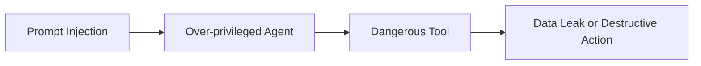

# Chapter 9: Anti-patterns in MLSecOps

## Why anti-patterns matter

Many security failures in AI systems do not stem from lack of advanced tools; they arise from wrong architectural decisions, excessive trust in the model, removal of simple controls, and lack of auditable evidence. This chapter summarizes the most common wrong patterns.

## Common anti-patterns

| Anti-pattern | Consequence | Correct alternative |
|---|---|---|
| running model without `Gateway` | no input, output, or telemetry control | use `AI Gateway` |
| full trust in model output | execution of wrong or unsafe decisions | output validation and human review |
| using real data in testing | data leakage and privacy violation | masked or controlled synthetic data |
| model without signature | possibility of substitution or tampering | `Model Signing` and attestation |
| RAG without ACL | disclosure of internal documents | authorization at retrieval time |
| Agent with many tools | tool abuse and privilege escalation | `Scoped Tool Access` |
| no Evidence Pack | inability to audit or analyze incidents | automatic evidence recording |
| shared `Vector DB` across tenants | information leakage between customers | separate physical index or strict isolation |
| direct Agent connection to `Production DB` | unauthorized data manipulation or export | limited tool, read-only view and `Intent Gate` |
| `Auto-Retrain` without security gate | release of poisoned or degraded model to production | full CT stages and gates |
| running tools without `Sandbox` | `RCE` or API abuse | separate container, limited egress and allowlist |
| using `Pickle` without scan | deserialization attack and malicious code execution | `ModelScan` and prohibition of unsafe formats |
| no prompt/response logging | inability to analyze incidents | runtime telemetry and controlled retention |
| replacing controls with tools | false sense of security | threat model, policy and evidence |

## Model without provenance

One of the most dangerous states is when the team does not know exactly what data, code, dependencies, and parameters were used to build the model. In such a case, even if the model works well, it is not defensible from a security standpoint.

Signs:

- model is in the registry but data origin is unclear.
- training code version is not recorded.
- security test results do not exist.
- model hash and signature are not stored.

## RAG without security boundary

In some architectures, every document in the organization enters the `Vector DB` and the model freely uses it when responding. This turns the chat system into a data disclosure path.

Correct controls:

- `Allowlist` for ingest sources
- access control at query time
- tenant separation
- removal of sensitive or unauthorized documents
- `Retrieval Leakage` testing

## Agent without tool control

An intelligent agent with access to many sensitive tools can, under `Prompt Injection` or planning error, turn from assistant into an internal attacker.

## One-time security testing

The model and its environment constantly change. If security testing runs only at initial release, retraining, data change, prompt change, tool change, or base model change can invalidate previous controls.

Correct pattern:

- security testing on every build
- regression testing for attack scenarios
- signed baseline
- monitoring at `Runtime`

## Practical principle

Wherever the system operates on implicit trust, a likely `Anti-pattern` exists. In `MLSecOps`, trust must be replaced with control, evidence, and limits.
