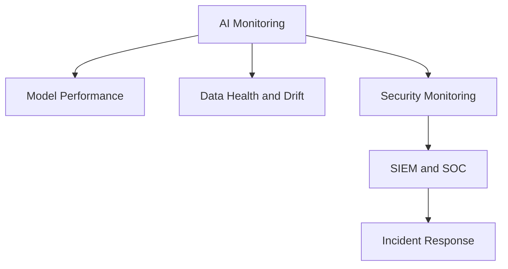
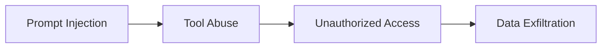

# Chapter 10: Monitoring, SOC, and Incident Response

## Monitoring in AI systems

AI monitoring is not just checking uptime or latency. Model behavior, data, prompts, tools, outputs, drift, and security incidents must also be observed.

Monitoring in `MLSecOps` must see three layers simultaneously:

| Layer | Sample indicators |
|---|---|
| `Model Performance Monitoring` | `Accuracy`, quality metric, latency, `P95/P99`, throughput, error rate, CPU/GPU/Memory consumption |
| `Data Health Monitoring` | `Data Drift`, `Concept Drift`, `Schema Deviation`, missing values, data distribution change and user behavior patterns |
| `Security Monitoring` | `Prompt Injection`, `Jailbreak`, `Tool Abuse`, `Model Extraction`, `RAG Poisoning`, `Memory Poisoning`, `Context Poisoning`, and abnormal user or Agent behavior |

## Data required for telemetry

| Data | Reason for importance |
|---|---|
| `Prompt` | analysis of prompt injection and abuse |
| `Response` | review of data leakage and unsafe output |
| `Session ID` | reconstruction of interaction path |
| `Trace ID` | linking incidents across services |
| `Model Version` | identification of compromised version |
| `Tool Call` | review of tool abuse |
| `Retrieval Event` | analysis of leakage or poisoning in RAG |
| `Policy Decision` | review of allow or block reason |
| `Guardrail Decision` | review of which control allowed/blocked/redacted input or output |
| `User Identity` | access and user behavior analysis |
| `Access Context` | reconstruction of user access level, tenant, role, and request source |
| `Authentication Event` | analysis of login, token, and authentication state |
| `Authorization Event` | review of authorization and access decisions |

## SOC integration

AI incidents must not be managed separately from the organization's security view. AI logs and alerts must enter `SIEM`, `SOAR`, incident management systems, and threat hunting processes.

| Tool or capability | Application |
|---|---|
| `SIEM` | log collection and correlation |
| `SOAR` | incident response automation |
| `Threat Intelligence` | attack analysis enrichment |
| `Case Management` | incident case management |
| `Threat Hunting` | discovery of hidden attack patterns |

## Detection Engineering

Logging alone is not enough. Threat detection rules must be defined for specific AI behaviors.

Sample detectable cases:

- increase in `Prompt Injection`
- `Jailbreak` attempts
- abnormal `Tool Call` rate
- model extraction attempts
- increased access to sensitive documents
- suspicious patterns in `Retrieval`
- outputs containing sensitive data
- abnormal agent behavior
- `Agent Misbehavior`
- `Excessive Tool Invocation`
- `Suspicious Retrieval Activity`
- privilege escalation or `Privilege Escalation` by agents

## Threat analysis with MITRE ATLAS

`MITRE ATLAS` can be a common language for SOC, Blue Team, and Red Team in analyzing AI incidents. Fuller threat mapping to `AML.T...` identifiers is in Chapter 12 and Appendix B of Chapter 15.

| Threat | ATLAS technique | ID |
|---|---|---|
| `Prompt Injection` | `LLM Prompt Injection` | `AML.T0051` |
| `Jailbreak` | `LLM Jailbreak` | `AML.T0054` |
| `Data Poisoning` | `Poison Training Data` | `AML.T0020` |
| `Model Extraction` | `Exfiltration via AI Inference API` | `AML.T0024` |
| `RAG Poisoning` | `RAG Poisoning` | `AML.T0070` |
| `Memory Poisoning` | `AI Agent Context Poisoning` | `AML.T0080` |
| `Tool Abuse` | `AI Agent Tool Invocation` | `AML.T0053` |
| `Data Exfiltration` | `Exfiltration via AI Agent Tool` | `AML.T0057` |

## Sample SIEM scenarios

| Scenario | Detection flow | Observable indicators |
|---|---|---|
| `Prompt Injection` attempt | user sends suspicious prompt, gateway blocks it, SIEM counts blocks per user/session. | number of blocked prompts, jailbreak attempt, block rate to total requests |
| tool abuse | agent invokes multiple or sensitive tools at abnormal volume and SIEM analyzes variety and volume of use. | tool call count, number of tools used, error rate, access to sensitive tool |

Thresholds must be set based on real baseline from staging or production environment. Fixed values without baseline can both create many false positives and hide real attacks.

## Sample attack chain

## Incident response

Incident response in AI must cover model and data in addition to service and infrastructure. It may be necessary to rollback the model, clean the index, delete agent memory, or review training data.

| Scenario | Initial action |
|---|---|
| data leakage from model output | stop output path, review logs, activate DLP |
| RAG contamination | remove poisoned document, re-index, review access |
| Agent tool abuse | disable tool, review trace, require human approval |
| poisoned or backdoored model | rollback to previous signed model |
| adversarial drift | stop automatic retraining and manual data review |

## False positive management

In AI systems, user and Agent behavior is diverse and simple rules can produce many false alerts. False positive management must be a permanent part of SOC operations.

| Control | Goal |
|---|---|
| periodic baseline | collect 2 to 4 weeks of normal traffic to set real thresholds |
| `Context-Aware Severity` | set alert severity based on full session behavior, not a single event |
| feedback loop | use SOC analyst feedback to refine rules |
| use-case segmentation | separate rules for internal user, public API, and Agent |
| temporary suppression | reduce unnecessary alerts during controlled deploy or maintenance |

The rule improvement cycle should include alert generation, SOC review, true/false positive labeling, rule refinement, new version release, and re-monitoring.

## Incident response SLA

| Level | Sample incident | Acknowledge | Containment | Postmortem |
|---|---|---|---|---|
| `P1 Critical` | active data leakage, malicious tool execution or successful Agent abuse | 15 minutes | 1 hour | mandatory, maximum 5 business days |
| `P2 High` | repeated bypass attempts, jailbreak or suspicious adversarial drift | 1 hour | 4 hours | recommended |
| `P3 Medium` | spike in block rate or anomaly without leakage evidence | 4 hours | 1 business day | if recurring |
| `P4 Low` | single block or internal test | 1 business day | not required | optional |

Incident severity must be determined based on actual impact on confidentiality, integrity, and availability—not merely alert count.

## Evidence required for incident analysis

| Artifact | Goal |
|---|---|
| `Prompt Trace` | reconstruction of attacker interaction |
| `Response Trace` | analysis of model response |
| `Model Version Snapshot` | identification of exact model version |
| `Conversation Evidence` | full session analysis |
| `Tool Invocation Logs` | review of Agent actions and multi-agent chain |
| `Session ID / Trace ID` | linking incidents |
| `Evidence Pack` | tamper-evident evidence retention |

## First 30 minutes of an incident

1. `Snapshot`: record prompt, response, tool call, model version, session id, and trace id.
2. `Containment`: disable high-risk tool, suspicious agent, or compromised endpoint.
3. `Verify`: check model signature, artifact integrity, and latest deploy or CT.
4. `Rollback`: return to last signed and approved version.
5. `Timeline`: record time and actions for postmortem.

Without an initial snapshot, analysis of many AI incidents will practically fail.

## Day-2 operations

| Operation | Goal |
|---|---|
| `Secret Rotation` | reduce credential disclosure risk |
| `Agent Permission Review` | remove old or unnecessary access |
| `Embedding Cleanup` | reduce leakage in RAG |
| `Prompt Template Review` | prevent drift and bypass |
| `Prompt Trace Retention Review` | control privacy and log volume |
| `Model Retirement` | remove obsolete model and artifacts |
| `SIEM Rule Tuning` | reduce false positives |

Many incidents arise from post-deploy neglect, not only model weakness.

## Security metrics

| Metric | Application |
|---|---|
| prompt injection rate | measure attack attempts |
| guardrail block rate | health of runtime controls |
| sensitive tool call count | detect abuse |
| retrieval rate from sensitive documents | detect potential leakage |
| drift score | detect data behavior change |
| rollback count | measure model release stability |

## SOC control prioritization

| Level | Control |
|---|---|
| `MUST` | runtime telemetry, prompt logging, tool logging, model version tracking and incident runbook |
| `SHOULD` | detection rule, correlation rule, SLA and threat hunting |
| `ADVANCED` | full `MITRE ATLAS` mapping, automation with `SOAR`, behavioral analytics and automated response |

## If only three SOC/Runtime controls can be implemented

1. Send unified telemetry including prompt, tool call, model version, and trace id to SIEM.
2. At least one detection rule for prompt injection and tool abuse with false positive process.
3. Incident runbook including snapshot, containment, and rollback.

## Practical principle

If AI behavior is not seen at `Runtime`, its security cannot be managed. Monitoring must be part of design from day one—not an add-on after deployment.

## Practical summary

- `Pipeline Security` alone is not sufficient; runtime must be continuously monitored.
- `Runtime Telemetry` is the foundation of AI security operations.
- detection rules must be tuned based on real baseline.
- false positive management is a permanent part of SOC operations.
- `Day-2 Operations` matters as much as deploy.
- success of AI incident response largely depends on quality of the initial snapshot.
