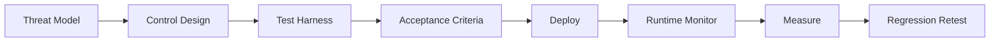

# Chapter 11: Governance, Compliance, and Evidence Pack

## Governance in MLSecOps

Governance means that decisions related to the model, data, risk, and release are explainable, traceable, and auditable. In AI systems, the absence of governance prevents teams from explaining how a model was built, why it was released, and what should be investigated in a security incident.

## OpenSSF MLSecOps Mapping (Whitepaper 2025)

`OpenSSF` mapped 22 security controls across three domains—`Data`, `Model`, and `DevOps`—in the whitepaper "Visualizing Secure MLOps." This document is the architectural reference for data scientist, ML engineer, and security team personas. Summary mapping:

| Domain | Example controls |
|---|---|
| Data | validation, anonymization, access control, lineage |
| Model | artifact scan, adversarial test, signing, registry hardening |
| DevOps | secret management, IaC scan, CI/CD attestation, runtime monitoring |

The organization's Evidence Pack must show which of these 22 controls—aligned with the threat model—have been implemented.

## AI Design Assurance Level (AI-DAL)

For high-risk systems (medical, financial, critical infrastructure), the `AI-DAL` concept (author-adapted from `DAL` ideas in safety-critical software engineering; not an published industry standard) sets the design assurance level according to adverse impact. Each AI-DAL level has a set of design, testing, and compliance artifact requirements. This approach complements `ISO/IEC 42001` and the `EU AI Act` for high-risk AI systems.

## FMEA-AI and STRIDE-AI

For structured threat modeling:

| Method | Application |
|---|---|
| `STRIDE-AI` | Mapping threats to ML assets (data, model, API) |
| `FMEA-AI` | Assessing fairness impact and algorithmic harm with Failure Mode and Effects Analysis |
| `Color Teams` | Combining red/blue/purple team for the ML development cycle |

## Reference frameworks

| Framework | Application |
|---|---|
| `NIST AI RMF` | Risk management for AI systems |
| `ISO/IEC 42001` | AI management system |
| `ISO/IEC 23894` | AI risk management |
| `OWASP LLM Top 10` | Threats to language models (2025 edition, stabilized) |
| `OWASP ML Top 10` | Threats to ML models (still `draft`) |
| `OWASP LLMSVS` | Verification standard for LLMs (structured testing and evaluation) |
| `MITRE ATLAS` | Modeling attack techniques against AI |
| `EU AI Act` | Legal requirements based on risk level |

## What is an Evidence Pack?

An `Evidence Pack` is a bundle of technical and managerial evidence showing how a model was built, evaluated, controlled, and released. This bundle should be generated automatically in the production pipeline.

## Recommended Evidence Pack contents

| Section | Evidence |
|---|---|
| Data | Data origin, version, owner, sensitivity level, scan results |
| Model | Version, parameters, metrics, hash, signature |
| Security | Results of adversarial, backdoor, and prompt injection tests |
| Supply chain | `SBOM`, `AI-BOM`, vulnerabilities, provenance |
| Policy | Gate decisions, policies, approvals |
| Deployment | Environment version, configuration, release method, rollback plan |
| Runtime | Telemetry, alerts, guardrail decisions |

## Evidence Pack components

| Component | Content | Application |
|---|---|---|
| Model identity | hash, version, source, and build date | Tracking in incidents and rollback |
| Supply chain | `SBOM/AI-BOM`, `SLSA`, `in-toto`, and provenance | Supply chain audit |
| Integrity | Digital signature with `Cosign/Sigstore` and verify result | Preventing artifact substitution |
| Security testing | Reports from `ModelScan`, `ART`, prompt injection, and poisoning | Demonstrating due diligence |
| policy | Quality gate log, `OPA/Conftest`, exceptions, and approver | Transparency of `Go/No-Go` decisions |
| runtime | Telemetry, alerts, and prompt trace in incidents | Incident response and postmortem |

## Relationship to compliance

| Framework | Relationship to Evidence Pack |
|---|---|
| `NIST AI RMF / ISO 42001` | The Evidence Pack is the operational output of the govern and map sections and shows that controls are actually implemented. |
| `EU AI Act` | For high-risk systems, documentation of data, post-deployment monitoring, and incident recording are fed from evidence and SOC telemetry. |
| `ISO/IEC 23894` | Risks in the risk register must trace to threat mapping, production checklist, and auditable controls. |

### Practical mapping of EU AI Act requirements (High-Risk systems) to controls

| EU AI Act requirement | Equivalent control in this article |
|---|---|
| `Risk Management System` (Art. 9) | Risk management + versioned threat model (Chapter 2) |
| `Data Governance` (Art. 10) | Data control, lineage, PII masking (Chapter 4) |
| `Technical Documentation` (Art. 11) | `Evidence Pack` and `AI-BOM` (Chapters 5, 11) |
| `Record-Keeping / Logging` (Art. 12) | Telemetry, prompt/tool logging (Chapter 10) |
| `Transparency` (Art. 13) | Model documentation, provenance, watermark |
| `Human Oversight` (Art. 14) | `HITL` and `Intent Gate` (Chapter 8) |
| `Accuracy, Robustness, Cybersecurity` (Art. 15) | Adversarial testing, signing, runtime guardrail (Chapters 5, 6, 7) |
| `Post-Market Monitoring` (Art. 72) | Runtime monitoring and SOC (Chapter 10) |

This mapping shows that MLSecOps technical controls can directly produce compliance evidence for the `EU AI Act`—provided that evidence is maintained automatically and in an auditable manner.

### Mapping EU AI Act requirements to Evidence Pack components

The table below shows which section of the `Evidence Pack` (Chapter 11) and what evidence should cover each legal requirement for high-risk systems:

| EU AI Act requirement | Evidence Pack component | Expected evidence |
|---|---|---|
| `Risk Management System` (Art. 9) | policy + threat model | Versioned threat model document, risk register, gate decisions |
| `Data Governance` (Art. 10) | Data | Lineage, data contract, PII scan report, dataset version |
| `Technical Documentation` (Art. 11) | Full bundle | Signed Evidence Pack for each deploy |
| `Record-Keeping / Logging` (Art. 12) | runtime + policy | Prompt/tool/retrieval log, retention policy, gate audit log |
| `Transparency` (Art. 13) | Model identity + supply chain | Provenance, `AI-BOM`, model documentation, and watermark (if applicable) |
| `Human Oversight` (Art. 14) | policy + runtime | `HITL` log, human approval runbook, kill switch |
| `Accuracy, Robustness, Cybersecurity` (Art. 15) | Security testing + integrity | `ART`/red team report, `ASR` relative to baseline, signature and verify |
| `Post-Market Monitoring` (Art. 72) | runtime | Telemetry, SOC alerts, drift report, postmortem |

> This mapping is technical guidance, not legal advice. Final interpretation of `EU AI Act` requirements rests with the organization's legal and compliance teams.

## Policy-as-Code

Security policies should not remain only in documents. They must be applied in an executable form in the pipeline and at runtime. Tools such as `OPA`, `Conftest`, or an internal policy engine can perform this work.

Example policies:

- A model without a signature is not allowed to be released.
- Data with unmasked `PII` is not allowed for training.
- A critical vulnerability in dependencies causes the build to stop.
- An `LLM` model without prompt injection testing is not allowed to deploy.
- An agent without an `Intent Gate` is not allowed to invoke sensitive tools.

## Responsibilities

| Role | Responsibility |
|---|---|
| Model owner | Defining purpose, acceptance criteria, and business risk |
| ML team | Training, evaluation, and version recording |
| Security team | Threat model, security testing, and policies |
| Platform team | Infrastructure, access, monitoring, and deployment |
| Governance team | Compliance, audit, and evidence management |

## Personas and shared responsibility

| Persona | Security focus | Area of responsibility |
|---|---|---|
| `Solution / ML Architect` | Secure architecture and service boundary | Introduction, pipeline, and MLOps alignment |
| `MLOps / AI Engineer` | Pipeline, deploy, and CT | Pipeline and tools |
| `Data Scientist / Engineer` | Data quality and experimentation | Data and experimentation |
| `Data Governance` | `PII`, compliance, and lineage | Data and compliance |
| `Product Security` | Threat model, gate, and assurance | Threats and pipeline |
| `SOC / IR` | Runtime, alerts, and incident evidence | SOC and evidence pack |

## Tamper-evident storage

Minimum practical steps for evidence retention:

1. Store the `Evidence Pack` in `S3` or equivalent with `Object Lock`.
2. Sign each bundle with `Cosign` and verify before deploy.
3. Separate write access from read access; audits should be read-only only.
4. In a `P1` incident, store an immediate snapshot in a separate bucket with lock.

For organizations with strict audit requirements, an advanced option is to use `Rekor Transparency Log` or a hash chain in the manifest.

## Security validation and assurance

A control without measurement of effectiveness is only a checkbox. The assurance loop must show that gates are actually effective and that deploy decisions are made based on numeric criteria.



| Stage | Output | Owner |
|---|---|---|
| `Test Harness` | Versioned suite in Git | Security + MLOps |
| Gate 7 | Metric report and suite hash | MLOps |
| Deploy decision | pass/fail relative to baseline | Model Owner |
| Production | Telemetry and feedback related to FP/FN | SOC |
| CT / retrain | Full suite regression | MLOps |

## Assurance metrics

| Control | Metric | Example acceptance | Frequency |
|---|---|---|---|
| `Policy Gate / OPA` | Violation detection rate in red team | 100% on critical rules | Every release |
| `LLM Gateway` | False negative on injection suite | Maximum 5% critical prompts | Monthly and after tune |
| `LLM Gateway` | False positive on benign suite | Maximum 2% | Monthly |
| `ART` | `ASR @ epsilon` | Maximum baseline + 2% | Every new model |
| `RAG Ingest` | Poison doc retrieval rate | Zero percent in regression set | Every index change |
| `Agent Output Gate` | Bypass in output-injection cases | Zero critical | Every agent release |

## Regression Security Score

For decision-making, a conceptual score can be defined:

```text
score = w1 * clean_metric + w2 * (1 - ASR_or_bypass_rate) + w3 * gate_pass_rate
```

Deploy is allowed only when:

```text
score(new) >= score(baseline_signed) - delta
```

The value of `delta` should be set in the organization's threat model; for example, `0.02`.

## Governance Benchmark Suite

For assurance to be repeatable, the security benchmark must be versioned and traceable:

1. Maintain the test suite in the repository with a tag such as `security-suite-v1.x`.
2. Any change to a gate or guardrail triggers re-running the suite in CI.
3. Record results in the `Evidence Pack` along with suite hash, execution date, and model version.
4. A false negative—an attack that should have been blocked but passed through—should be tracked as an incident or defect with higher severity than a false positive.

## Verification vs. validation

| Axis | `Verification` | `Validation` |
|---|---|---|
| Question | Is the control implemented correctly? | Is the model or system sufficient for production? |
| Example | OPA rule deployed and gateway is in the traffic path | `ASR`, bypass rate, and accuracy are acceptable |
| Location | Infrastructure audit and production checklist | Gate 7 and Canary |

Maturity level 2 means a stable gate and suite exist. Maturity level 3 means automated regression score and false negative error tracking in the SOC are in place.

## Vulnerability disclosure and external intelligence sources

`MLSecOps` governance should not be internal-only. The organization must define a path for receiving and publishing model/AI infrastructure vulnerabilities:

| Source / mechanism | Application |
|---|---|
| `huntr` (huntr.com) | Dedicated AI/ML bug bounty platform for receiving vulnerability reports |
| `AI Vulnerability Database (AVID)` | Database of known model vulnerabilities |
| `AI Incident Database` | Lessons learned from real AI incidents |
| `MITRE ATLAS` | Updates to attacker tactics/techniques |
| Internal `Coordinated Vulnerability Disclosure` | Formal path for reporting vulnerabilities in the organization's models |

Recommendation: Define a `security.txt` or CVD process for the organization's AI models and APIs, and feed these sources back periodically into the threat model (Chapter 2) and test suite (Chapter 6).

## Practical principle

If a model is not auditable, it is not trustworthy from an organizational perspective. Evidence must be produced concurrently with building and releasing the model—not after an incident and not manually.
