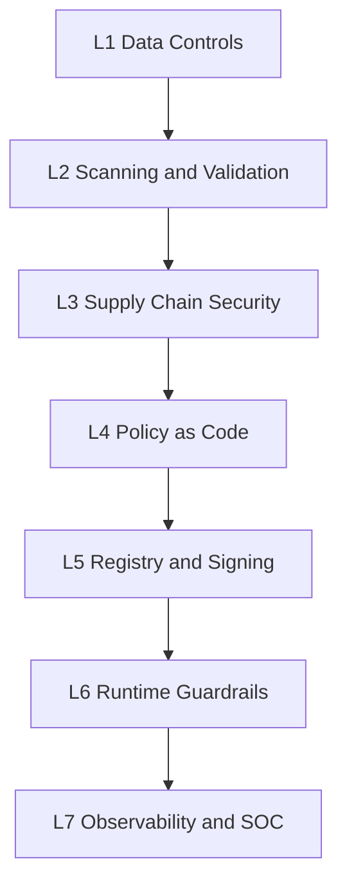

# Chapter 12: Threat, Control, and Tool Mapping

## Purpose of Mapping

Threat, control, and tool mapping helps teams understand which control is required for each risk and which tools can implement or support that control. Tools do not replace secure architecture, but they make control execution repeatable and auditable.

## Primary Mapping

| Threat | Control | Tool or Example Capability |
| --- | --- | --- |
| `Data Poisoning` | Data validation, lineage, anomaly detection | `Great Expectations`, `Evidently` |
| `PII` leakage | Sensitive data identification and masking | `Presidio`, enterprise `DLP` |
| Poisoned model | Artifact scan and backdoor test | `ModelScan`, internal test |
| Vulnerable dependency | `SCA` and container scan | `Trivy`, `Syft`, `Grype` |
| Secret in code or notebook | Secret scanning | `Gitleaks`, `TruffleHog` |
| `Prompt Injection` | Gateway, red team test, guardrail | `Promptfoo`, `Garak`, internal gateway |
| `RAG Poisoning` | Ingest and retrieval ACL control | Internal pipeline, policy engine |
| `Tool Abuse` | Intent gate and scoped access | Policy engine, IAM |
| `Memory Poisoning` | Sanitization, TTL, and provenance | Internal memory gateway |
| Runtime leakage | Telemetry and output DLP | `SIEM`, `DLP`, `AI Gateway` |
| `Gradient Leakage` (federated) | Secure aggregation, DP | `TensorFlow Privacy`, `OpenDP` |
| Attack on ML security (IDS/malware) | Adversarial robustness in detection model | `ART`, retraining |
| Multimodal injection | OCR/audio moderation | Multimodal gateway |
| API key for LLM | Proxy gateway, kill switch | `BlackVault`, `Vault` |
| Autonomous AI Malware | Agent behavior monitoring, sandboxing, runtime restriction | AI Gateway, Agent Monitoring |
| AI Worm | Propagation detection, isolation, trust boundaries | Runtime monitoring, EDR/XDR |
| AI-driven Reconnaissance | Asset discovery monitoring, attack surface management | ASM tools, SIEM analytics |
| Autonomous Exploit Generation | Vulnerability intelligence, exploit detection | Threat intelligence platform |
| AI-driven Lateral Movement | Least privilege, segmentation, agent authorization | IAM, Policy Engine |
| Compute Hijacking | GPU workload monitoring, resource anomaly detection | GPU telemetry, infrastructure monitoring |
| Agent Persistence | Memory validation, session control | Agent gateway, memory security layer |

## Tool Layers



## Tools by Pipeline Stage

| Stage | Control | Example Tool |
| --- | --- | --- |
| Data ingestion | Schema, PII, quality | `Great Expectations`, `Presidio` |
| Code and notebook | Secret and dependency scan | `Gitleaks`, `Trivy`, `NB Defense` |
| Model | Artifact scan, adversarial test | `ModelScan`, `ART` |
| Supply chain | `SBOM` and signing | `Syft`, `CycloneDX`, `Cosign` |
| Gates | Policy-as-code | `OPA`, `Conftest` |
| Runtime | Guardrail and gateway | `NeMo Guardrails`, `Llama Guard`, internal gateway |
| SOC | Telemetry and detection | `ELK`, `Grafana`, `SIEM` |

## Layered Tool Architecture

| Layer | Role | Pipeline Stage | Example Tool |
| --- | --- | --- | --- |
| `L1 — Data and Experimentation` | Lineage, versioning, and reproducibility | 2, 5 | `MLflow`, `DVC`, `Great Expectations` |
| `L2 — Security Scanning and Testing` | `SAST/SCA`, artifact scan, IaC, adversarial and LLM testing | 3, 7 | `Gitleaks`, `Trivy`, `Checkov`, `tfsec`, `SonarQube`, `lintML`, `ModelScan`, `ART`, `Garak`, `PyRIT`, `Promptfoo`, `Agentic Security`, `PurpleLlama`, `Mindgard`, `AI-exploits`, `AI-Infra-Guard` |
| `L3 — AI Supply Chain` | `SBOM/AI-BOM`, signing, and provenance | 2, 9 | `Syft`, `CycloneDX`, `Cosign`, `Sigstore`, `SLSA` |
| `L4 — Policy-as-Code` | Quality gate and dataset compliance | 4, 8 | `OPA`, `Conftest`, `Kyverno` |
| `L5 — Registry and Deployment` | Signed model storage, secret, and key | 9, 10 | `Model Registry`, `S3/Nexus`, `Vault/KMS` |
| `L6 — Runtime and Guardrails` | Prompt filtering, moderation, and AI gateway | Production | Internal gateway, `NeMo Guardrails`, `Llama Guard`, `Lakera Guard`, `Patronus` |
| `L7 — Observability and SOC` | Drift, alert, and SIEM | 10 | `ELK`, `Grafana`, `Evidently`, `WhyLabs`, `HiddenLayer`, `Protect AI AIRS` |

### Additional runtime controls (L6):

| Control | Purpose |
| --- | --- |
| Agent Behavior Monitoring | Detect abnormal autonomous decisions |
| Tool Execution Policy | Restrict agent actions |
| Runtime Isolation | Prevent propagation between systems |
| Resource Monitoring | Detect unauthorized AI workloads |
| Session Analysis | Detect multi-step attack behavior |

## Practical Tool Guide for Building a Security Pipeline

> The commands and parameters provided in this section are common examples at the time of writing only. Tool versions, parameters, and `exit code` behavior may change; therefore, always refer to the official tool documentation and validate each tool's output in your real environment.

This section is the practical reference for building an `MLSecOps` security pipeline. For each tool: purpose, installation, basic command, gate behavior (i.e., when the `build` should fail), and output suitable for logging in the `Evidence Pack` are provided. The key principle is that every tool must produce an **exit code** or structured output so the pipeline can automatically make a `Go/No-Go` decision.

### Design Principle: Every Control Must Be Able to Stop the Pipeline

```text
scan → parse result → decision (pass/fail) → evidence → (block on fail)

```

A tool that only reports but does not stop the pipeline is an `Anti-pattern` (Chapter 9). Each stage must either return `exit code != 0` or have its `JSON` output evaluated by a policy engine.

### L2 — Model Artifact Scan: ModelScan

Purpose: Detect malicious code and unsafe operations in model files (`pickle`, `H5`, `SavedModel`, `PyTorch`) before `load`.

```bash
pip install modelscan
# Scan a model file or folder
modelscan -p ./models/model.pkl
# JSON output for Evidence Pack
modelscan -p ./models/ -r json -o modelscan-report.json

```

Gate behavior: `modelscan` returns these exit codes, which can be used directly in the pipeline:

| Exit Code | Meaning | Pipeline Action |
| --- | --- | --- |
| `0` | Clean, no vulnerabilities | Continue |
| `1` | Scan successful, **vulnerability found** | `fail build` |
| `2` | Scan error | Investigate and stop |
| `3` | Unsupported file | Warning |
| `4` | Usage error | Fix command |

Evidence: `modelscan-report.json` file. This control is mandatory at stage 2 (`Load Artifacts`).

### L2 — Secret Scanning: Gitleaks

Purpose: Find API keys, tokens, and credentials in code, notebooks, and git history.

```bash
# Scan repository and fail if a secret is found
gitleaks detect --source . --report-format json --report-path gitleaks-report.json --exit-code 1

```

Gate behavior: With `--exit-code 1`, finding any secret stops the pipeline. Evidence: `gitleaks-report.json`.

### L2 — Dependency and Container Scan: Trivy

Purpose: `SCA` for dependencies, container image scan, and IaC misconfiguration.

```bash
# Scan project dependencies
trivy fs --scanners vuln,secret,misconfig --severity HIGH,CRITICAL --exit-code 1 .
# Scan inference service image
trivy image --severity CRITICAL --exit-code 1 myorg/llm-serving:1.4.0

```

Gate behavior: `--exit-code 1` combined with `--severity CRITICAL` causes only critical vulnerabilities to stop the build. Evidence: output with `--format json`.

### L2 — Notebook Scan: NB Defense and lintML

Purpose: Notebooks and ML code often contain secrets, sensitive output, and unsafe patterns.

```bash
# NB Defense for notebook scanning
pip install nbdefense && nbdefense scan ./notebooks/
# lintML: security linter for ML code (from Nvidia); requires Docker for underlying scanners
pipx run lintml ./src/

```

Gate behavior: Finding a secret or high-risk pattern must fail the build. This control runs at stage 3.

### L2 — Classic Model Adversarial Test: ART

Purpose: Measure resistance of `Tabular/Vision/Speech` models against manipulated input and compute `ASR`.

```python
from art.estimators.classification import SklearnClassifier
from art.attacks.evasion import FastGradientMethod, ProjectedGradientDescent

classifier = SklearnClassifier(model=model)
attack = ProjectedGradientDescent(estimator=classifier, eps=0.1)
x_adv = attack.generate(x=x_test)
asr = compute_attack_success_rate(model, x_test, x_adv, y_test)
assert asr <= BASELINE_ASR + 0.02, "ASR exceeded threat model threshold"  # fail Gate 7

```


Gate behavior: Compare `ASR` with baseline; exceeding threshold = fail at Gate 7. Evidence: `ASR @ epsilon` report and test set hash.

### L2 — LLM Security Test: Garak

Purpose: Scan `LLM` vulnerabilities with 50+ probes (prompt injection, jailbreak, encoding, leakage, toxicity).

```bash
python -m pip install -U garak
# Run OWASP LLM01-related probes on a model
python -m garak --target_type openai --target_name gpt-4o \
  --probes promptinject,dan,encoding,leakreplay \
  --report_prefix garak-ci
# Filter probes by OWASP tag
python -m garak --target_type huggingface --target_name my-model --probe_tags owasp:llm01

```

Gate behavior: `garak` produces a `JSONL` report with success rate per probe; a script must compare `bypass rate` with the threat model threshold and fail the build if exceeded. Evidence: `garak-ci.report.jsonl`.

### L2 — Red Team and LLM/RAG/Agent Evaluation: Promptfoo

Purpose: Framework-based automated red team (`owasp:llm`, `mitre:atlas`, `eu:ai-act`) and `CI` integration.

Example `promptfooconfig.yaml`:

```yaml
targets:
  - id: https
    label: prod-assistant
    config:
      url: https://api.internal/llm
      method: POST
      headers: { 'Content-Type': 'application/json' }
      body: { prompt: '{{prompt}}' }
redteam:
  frameworks:
    - owasp:llm
    - mitre:atlas
  plugins:
    - owasp:llm
    - pii
    - rag-poisoning
  strategies:
    - prompt-injection
    - jailbreak

```

```bash
# Run red team in CI with context logging
npx promptfoo@latest redteam run -c promptfooconfig.yaml -o results.json \
  --tag git.sha="$CI_COMMIT_SHA"

```

Gate behavior: `results.json` output is compared with acceptance threshold (e.g., zero critical bypass). Evidence: `results.json` + commit tag.

### L2 — Multi-Stage Red Team: Microsoft PyRIT

Purpose: Multi-turn attack automation and advanced jailbreak for LLM and agent.

```bash
pip install pyrit
# PyRIT is typically run as an orchestrator script (multi-turn attack)
python redteam/pyrit_orchestrator.py --target prod-assistant --strategy crescendo

```

Gate behavior: Suitable for deep seasonal testing or before major release, not every build. Evidence: conversation report and outcome.

### L3 — SBOM Generation: Syft

Purpose: Software dependency inventory for the supply chain.

```bash
# Install
curl -sSfL https://raw.githubusercontent.com/anchore/syft/main/install.sh | sh -s -- -b /usr/local/bin
# SBOM from project environment and image
syft dir:. -o cyclonedx-json=sbom.cdx.json
syft myorg/llm-serving:1.4.0 -o spdx-json=image-sbom.spdx.json

```

Evidence: `sbom.cdx.json`. This is produced at stages 2 and 9.

### L3 — AI-BOM (ML-BOM) Generation: CycloneDX / cdxgen

Purpose: Beyond SBOM; record model, dataset, prompt, and AI services. The `CycloneDX 1.7` standard (approved 2025, ECMA-424) supports `ML-BOM`.

```bash
# With cdxgen (OWASP CycloneDX project)
# Generate dedicated AI-BOM including model, prompt, and MCP
npx @cyclonedx/cdxgen@latest aibom .
# Or full mode with governance audit
npx @cyclonedx/cdxgen@latest -r --include-formulation -o aibom.json --bom-audit --bom-audit-categories ai-bom

```

For HuggingFace models, `OWASP AIBOM Generator` extracts model card metadata. Evidence: `aibom.json` (includes hash of each weight file, dataset version, and provenance). For compliance, AI-BOM can be compared against `EU AI Act Annex IV` requirements (Chapter 11).

### L3 — Model Signing: Sigstore model-signing

Purpose: Cryptographic model signing to prove authenticity and prevent tampering. This project (`sigstore/model-transparency`, version 1.0 in 2025, in collaboration with OpenSSF/NVIDIA/HiddenLayer) is designed specifically for ML models and records signatures in the `Rekor` transparency log.

```bash
pip install model-signing
# Keyless signing with Sigstore (default)
model_signing sign ./models/model.safetensors --signature model.sig
# Verify before deployment
model_signing verify ./models/model.safetensors \
  --signature model.sig \
  --identity "ci@myorg.com" \
  --identity_provider "https://token.actions.githubusercontent.com"

```

Gate behavior: If `verify` fails, deployment must stop. Evidence: `model.sig` + Rekor record. `Cosign` can also be used for container and general artifact signing.

### L4 — Policy-as-Code: OPA / Conftest

Purpose: Convert security policies into executable code in `Quality Gate`s (stages 4 and 8).

Example policy (`Rego`) requiring signature and absence of critical vulnerabilities:

```rego
package mlsecops.gate

deny[msg] {
  input.modelscan.issues_count > 0
  msg := "Model contains unsafe artifact"
}

deny[msg] {
  not input.model.signed
  msg := "Model is not signed"
}

deny[msg] {
  input.trivy.critical_count > 0
  msg := "Dependency with critical vulnerability"
}

```

```bash
# Evaluate aggregated scan output against policy
conftest test evidence-bundle.json --policy ./policies/

```

Gate behavior: Any `deny` causes the gate to fail. Evidence: `OPA/Conftest` decision log.

### L6 — Runtime Guardrail: NeMo Guardrails

Purpose: Control LLM input/output at runtime (jailbreak detection, topic control, output moderation).

```bash
pip install nemoguardrails

```

```yaml
# config/rails.yaml
rails:
  input:
    flows:
      - check jailbreak
      - check sensitive data
  output:
    flows:
      - self check output
      - mask pii

```

Runtime behavior: This control runs in production, not in build; but its block/allow telemetry must go to `SIEM` (Chapter 10). Alternative tools: `Lakera Guard`, `Llama Guard`, internal gateway.

### L2 — MLOps Infrastructure and Agent Testing

Purpose: In addition to model and LLM, the `MLOps` infrastructure itself and agent logic must also be tested (Chapter 5).

```bash
# AI-exploits (Protect AI): known exploits against MLOps systems such as MLflow/Ray
git clone https://github.com/protectai/ai-exploits && cd ai-exploits
# AI-Infra-Guard (Tencent): discover security risks in AI infrastructure
# Agentic Security: red team for agents and tool misuse
pip install agentic_security

```

Behavior: These tests are typically run in staging and on a seasonal basis or before release, not every build. Critical findings must stop release.

### L2 — Model Privacy Audit

Purpose: Measure `Membership Inference` and `Model Inversion` risk before publishing a model trained on sensitive data (Chapter 4).

```bash
# PrivacyRaven (Trail of Bits): black-box privacy leakage test
pip install privacyraven
# ML Privacy Meter: quantitative leakage risk assessment
pip install ml-privacy-meter

```

Gate behavior: If membership inference success rate exceeds the threat model threshold, the model must be retrained with `DP-SGD` or hardened. Evidence: privacy risk report.

### Summary Table: Tool, Command, and Gate Behavior

| Tool | Stage | Key Command | Build Stop Criterion |
| --- | --- | --- | --- |
| `ModelScan` | 2 Load | `modelscan -p model.pkl -r json` | exit code `1` |
| `Gitleaks` | 3 Scan | `gitleaks detect --exit-code 1` | Any secret found |
| `Trivy` | 3 Scan | `trivy fs --exit-code 1 --severity CRITICAL` | Critical CVE |
| `lintML` / `NB Defense` | 3 Scan | `lintml ./src` / `nbdefense scan` | Unsafe pattern/secret |
| `ART` | 7 Test | Python script + assert ASR | `ASR > baseline+δ` |
| `Garak` | 7 Test | `garak --probes promptinject ...` | High bypass rate |
| `Promptfoo` | 7 Test | `promptfoo redteam run` | critical bypass > 0 |
| `Syft` | 2, 9 | `syft dir:. -o cyclonedx-json` | — (evidence generation) |
| `cdxgen aibom` | 2, 9 | `aibom .` | — (evidence generation; enforce completeness via `Conftest/OPA`) |
| `model-signing` | 9 Sign | `model_signing sign/verify` | Verify failure |
| `Conftest/OPA` | 4, 8 Gate | `conftest test evidence.json` | Any `deny` |
| `NeMo Guardrails` | Runtime | config rails | Block in production |

## OWASP ML Top 10 Mapping to MLOps Stages

This table is important for classic models and the `MLOps` lifecycle. Note that `OWASP ML Top 10` is still a draft and identifiers may change:

| `MLOps` Stage | Related Threats |
| --- | --- |
| `Planning and Design` | All threats, because weak design spreads risk across the entire lifecycle |
| `Data Engineering` | `ML02 Poisoning`, `ML06 Supply Chain`, `ML08 Skewing` |
| `Experimentation` | `ML06`, `ML07 Transfer Learning`, `ML10 Model Poisoning` |
| `Pipeline Dev & Test` | `ML02`, `ML06`, `ML10` |
| `CI / CD` | `ML06 Supply Chain` |
| `Continuous Training` | `ML02`, `ML06`, `ML08`, `ML10` |
| `Model Serving` | `ML01 Input Manipulation`, `ML03 Inversion`, `ML04 Membership`, `ML05 Theft`, `ML09 Output Integrity` |
| `Continuous Monitoring` | `ML01`, `ML02`, `ML08 Skewing`, `ML09` |

## Threat, Control, and Tool Reference Card

The consolidated and complete version of this card (with a `Phase` column and additional details) appears in **Appendix A of Chapter 15**. To avoid duplication, please refer to that appendix for the full table mapping threats to tools and lifecycle stages.

## MITRE ATLAS Mapping

| Threat | Technique | ID |
| --- | --- | --- |
| `Prompt Injection` | `LLM Prompt Injection` | `AML.T0051` |
| `Jailbreak` | `LLM Jailbreak` | `AML.T0054` |
| `Data Poisoning` | `Poison Training Data` | `AML.T0020` |
| `Model Extraction` | `Exfiltration via AI Inference API` | `AML.T0024` |
| `Adversarial Evasion` | `Evade AI Model` | `AML.T0015` |
| `Supply Chain` | `Publish Poisoned Models` | `AML.T0058` |
| `RAG Poisoning` | `RAG Poisoning` | `AML.T0070` |
| `Retrieval Content Crafting` | `Retrieval Content Crafting` | `AML.T0066` |
| `Memory Poisoning` | `AI Agent Context Poisoning` | `AML.T0080` |
| `Tool Abuse` | `AI Agent Tool Invocation` | `AML.T0053` |
| AI Reconnaissance | `Discover AI Agent Configuration` | `AML.T0067` |
| AI Worm Propagation | `AI Agent Context Poisoning` (propagation via shared context) | `AML.T0080` |
| Model Resource Abuse | `Cost Harvesting` | `AML.T0034` |

## Commercial Tool Market Map

In addition to open-source tools, the commercial `MLSecOps` ecosystem is growing. The purpose of this table is to introduce **categories** for build-vs-buy decisions, not to endorse or promote specific products; selection should be based on the "Tool Selection Criteria" in the next section:

| Category | Example Market Players | Use Case |
| --- | --- | --- |
| Comprehensive AI security platform | `HiddenLayer`; `Protect AI` (Palo Alto Networks / Prisma AIRS, 2025); `Robust Intelligence` (Cisco, 2024) | Model scan, threat detection, audit |
| Guardrail / Runtime LLM | `Lakera`, `Prompt Security`, `CalypsoAI`, `Lasso Security` | Prompt/output filtering in production |
| AI governance and compliance | `Credo AI`, `Cranium` | Governance, policy, and compliance documentation |
| Specialized red teaming | `Adversa`, `Mindgard` | Adversarial testing of models and agents |
| Privacy and synthetic data | `Private AI`, `Nightfall`, `Gretel`, `Tonic`, `Skyflow` | PII masking, DLP, and synthetic data |
| Secure federated learning | `Mithril Security`, `DynamoFL`, `Devron` | Distributed training with privacy preservation |

Note: Mentioning a product does not constitute a recommendation. Vendor ownership and product integration may have changed since publication; verify current status before procurement. For selection, first identify the threat and control, then evaluate open-source and commercial options against the criteria below.

## Tool Selection Criteria

A suitable tool should have several characteristics:

* Integrate with existing `CI/CD`.
* Provide structured output for the `Evidence Pack`.
* Be capable of failing the pipeline.
* Be versionable and auditable.
* Align with organizational policies.
* Not require permanent manual exceptions.

## Emerging AI-native Threats

Modern MLSecOps must consider threats beyond traditional ML attacks. AI-native threats introduce autonomous behavior, where attackers can use AI systems to discover targets, generate attack strategies, move through connected environments, and abuse AI infrastructure.

Therefore, future MLSecOps pipelines must include:

* Agent behavior security
* Runtime autonomy control
* AI workload monitoring
* Propagation detection
* Adaptive red teaming

Security validation must evaluate not only whether a model is accurate or safe, but whether the complete AI system can resist autonomous attack behavior.

## Practical Principle

Tools should make security controls actionable, not replace security thinking. First identify the threat and control, then select the tool.
